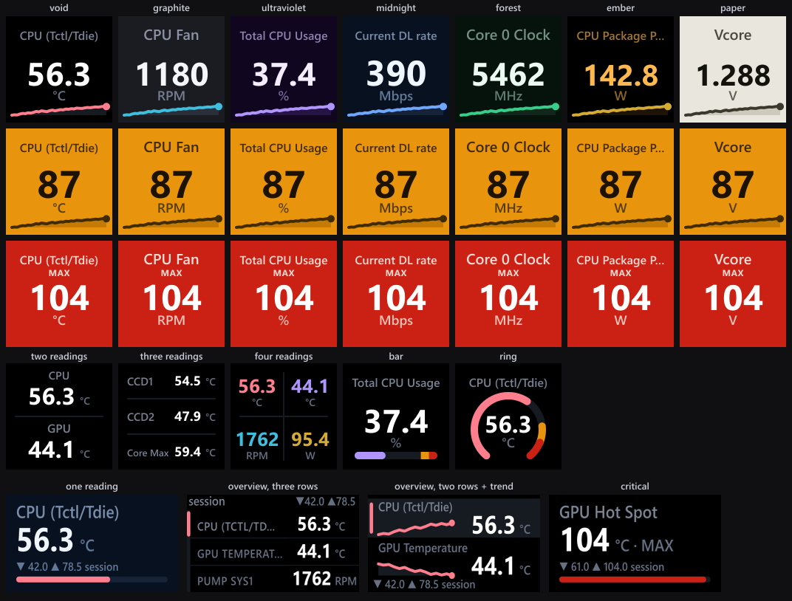

# HWiNFO Sensors for Stream Deck

Live [HWiNFO](https://www.hwinfo.com) temperatures, clocks, fan speeds, usage
and power on your Elgato Stream Deck. Keys show up to four readings. Stream
Deck + and + XL dials show a single reading or a two- or three-row overview.

**Windows 10+ x64. Free, MIT licensed. No ads, no telemetry.**

[Documentation](https://docs.slawrensen.com/hwinfo-streamdeck/) ·
[GitHub download](https://github.com/slawrensen/hwinfo-streamdeck/releases/latest) ·
[Elgato Marketplace](https://marketplace.elgato.com/product/hwinfo-sensors-82436166-3d61-4527-9034-8fdf16d92c54)

<p align="center">
  
</p>

*Production renderers with sample readings and generated histories. This is
a layout comparison, not a photograph of hardware. The board predates the
1.7 contrast changes described below.*

> **1.7 is a release candidate.** It combines per-reading dial colors with
> source, identity and history fixes. [What changes for you](docs/whats-new-1.7.md).
> Hardware qualification is still in progress.

## Requirements

- Windows 10 or later, x64; Stream Deck software **6.9+**.
- [HWiNFO](https://www.hwinfo.com/download/) running with **Shared Memory
  Support** or **Gadget reporting** enabled.
- A Stream Deck key device, or a Stream Deck + / + XL for dials.
  See [hardware coverage](docs/hardware.md) for tested and simulated devices.

## Quick start

1. Install from the Marketplace, or double-click the `.streamDeckPlugin`
   download from GitHub Releases.
2. Start HWiNFO. Enable **Shared Memory Support** in Settings and open its
   Sensors window. **Sensors-only** mode works too.
3. Drag **HWiNFO Sensors > Sensor Reading** onto a key. Pick a reading from
   the searchable list.

[Setup guide](docs/getting-started.md) · [Troubleshooting](docs/troubleshooting.md)

## Data sources: Shared Memory vs. Gadget

| | Shared Memory | Gadget registry |
| --- | --- | --- |
| Readings | Readings HWiNFO publishes through Shared Memory | Only readings you enable for Gadget |
| HWiNFO MIN / MAX / AVG | Available | Unavailable; historical key and detail modes show **N/A** |
| Free HWiNFO | Sharing expires after 12 hours | No sharing timer |
| Enable | Settings > **Shared Memory Support** | Configure Sensors > **HWiNFO Gadget** > enable reporting and tick each reading |

**Auto** prefers Shared Memory, falls back to Gadget when available, and
returns to Shared Memory when it recovers. Saved readings need
[explicit links](docs/data-sources.md#link-readings-across-providers) to work
across both sources. Similar names are not enough to identify the same sensor.

Gadget has no producer heartbeat or atomic snapshot guarantee. **Age unknown**
means the plugin cannot tell a steady reading from an old registry value.
Two ticked Gadget readings that share a source name and label are both
withheld while both are ticked (HWiNFO reports some readings twice under one
name, such as a GPU fan in RPM and in percent): untick or relabel one of them
in HWiNFO and the other comes back on its own. Most Gadget selections saved
by 1.6.0 keep working after the upgrade; the
[source guide](docs/data-sources.md#enabling-gadget-reporting) lists the ones
that need a reselection.

## Sensor Reading (keys)

Choose one reading, two stacked readings, three rows, or four cells. Set a
label, theme, text color and decimal precision. A single-reading key can
show a sparkline, bar or ring.

Press a key to cycle **current > MIN > MAX > AVG**. Those historical fields
come from HWiNFO and require Shared Memory. Alerts always use the current
value, even while a historical value is displayed.

Set **Press does** to open [sensor details](docs/sensor-details.md) for a
whole source, a custom list, or a filter such as `*gpu*fan*`. Detail pages
support multi-reading tiles and a Back tile that can also show readings.

[All key settings](docs/sensor-reading.md) · [Thresholds and alerts](docs/thresholds-alerts.md)

## Sensor Dial (Stream Deck +)

Single view shows a value, range bar and local session MIN/MAX. Two- and
three-row views show several readings together. Rotate through a saved set
or named groups; auto-cycle can advance them on a timer.

The default **Legacy** controls rotate to switch readings, push to reset
the session and touch to cycle statistics. **Elite** and **Custom** presets
offer other gesture mappings. Local session averages count accepted
observations, not elapsed time. Data gaps and source or unit changes start
a new session.

In the 1.7 candidate, **Appearance > Reading colors** assigns colors to
individual numbers on multi-row dials. Choose Signal, Pairs or Uniform,
then adjust individual readings. Alerts and valid Custom Text colors take
priority. Individual reading colors remain off until you enable them.

[Dial settings and colors](docs/sensor-dial.md) · [Controls and presets](docs/controls.md)

## HWiNFO Control (keys)

A **HWiNFO Control** action can switch readings, pause auto-cycle, pin a
reading or reset local statistics. Target one dial by its **Link ID**, or
all visible dials. It also works as a Multi Action step.

[Control action setup](docs/controls.md#the-hwinfo-control-key-action)

## Themes

Choose **Void, Graphite, Ultraviolet, Midnight, Forest, Ember or Paper** per
action, or set one deck default. **Text** offers Theme, Dim or Custom.
Optional **Type accents** color display accents by sensor category.

Warnings use amber; critical alerts use red.
Alerts override decorative colors. Built-in value, unit and numeric
statistic colors have at least 4.5:1 authored contrast against their
rendered background, and Dim keeps labels at least as readable as units.
Custom colors and individually chosen reading, quad cell and tile colors
are kept as entered in Theme mode and only dimmed in Dim mode, so check
those on your display.

[Themes](docs/themes.md) · [Alert behavior](docs/thresholds-alerts.md)

## The display system

Key layouts use fixed baselines and tested geometry. Images in this repo
come from the production renderers, settings-panel captures or identified
hardware photographs. Rendered contrast and geometry tests do not establish
physical readability. See the [display reference](docs/themes.md#the-display-system).

## Key states you might see

| Key shows | What to do |
| --- | --- |
| **Start HWiNFO** | Open HWiNFO's Sensors window and enable sharing. |
| **Source busy** | Wait for the next poll. Shared Memory may be locked, or Gadget fields may have changed during a scan. |
| **Shared Memory off** | Re-enable sharing. Free HWiNFO turns it off after 12 hours. |
| **Tick sensors in Gadget** | Enable readings under Configure Sensors > HWiNFO Gadget. |
| **Not updating** | Check HWiNFO's Sensors window and sharing settings. |
| **Age unknown** | Check Gadget reporting. Unchanged registry values cannot prove that HWiNFO is still updating. |
| **Bridge failed** | Reinstall the plugin. If Windows reports a block, keep that report for support. |
| **Access denied** | Check the Windows account, session and permissions. See the troubleshooting guide before changing elevation. |
| **Source error** | Open settings and copy the support report. |
| **Pick a sensor** | Select a reading in the action's settings. |
| **Sensor missing** | Check the saved selection, the current source and any explicit source link. |

[Status screens and fixes](docs/troubleshooting.md)

One reader serves all keys and dials. It polls once per second by default,
configurable from 250 ms to 5 s. HWiNFO updates on its own schedule. Reading
faster does not create extra sensor samples.

## Building from source

Use Windows, Node 20+ and the native build prerequisites in
[native/hwsm/TESTING.md](native/hwsm/TESTING.md).

```bash
npm ci
npm run build:native
npm run build
npm run lint
npm run typecheck
npm test
npm run suite:full
npm run pack
```

The full suite includes mock-host tests and the screenshot pipeline; live
sensor checks need HWiNFO. `npm run probe` checks the live reader. Contributor
instructions are in [AGENTS.md](AGENTS.md), measurements in [PERF.md](PERF.md).

For development, run `streamdeck dev`, then
`streamdeck link com.lawrensen.hwinfo.sdPlugin`. `npm run watch` rebuilds and
restarts the linked plugin when source files change.

The native reader exposes opaque sessions through Node-API. Every Shared
Memory read requires HWiNFO's consistency mutex. Release artifacts include
SHA-256 hashes. The native binary is unsigned; verification instructions
and the disclosure policy are in [SECURITY.md](SECURITY.md).

## License

[MIT](LICENSE). Inspired by [shayne/hwinfo-streamdeck](https://github.com/shayne/hwinfo-streamdeck),
the original Go plugin; this TypeScript implementation shares no code.
Credits: [NOTICE.md](NOTICE.md).

Not affiliated with, endorsed by, or sponsored by REALiX, s.r.o. or Elgato.
"HWiNFO" is a trademark of REALiX, s.r.o.; "Stream Deck" and "Elgato" are
trademarks of Corsair Memory, Inc.
