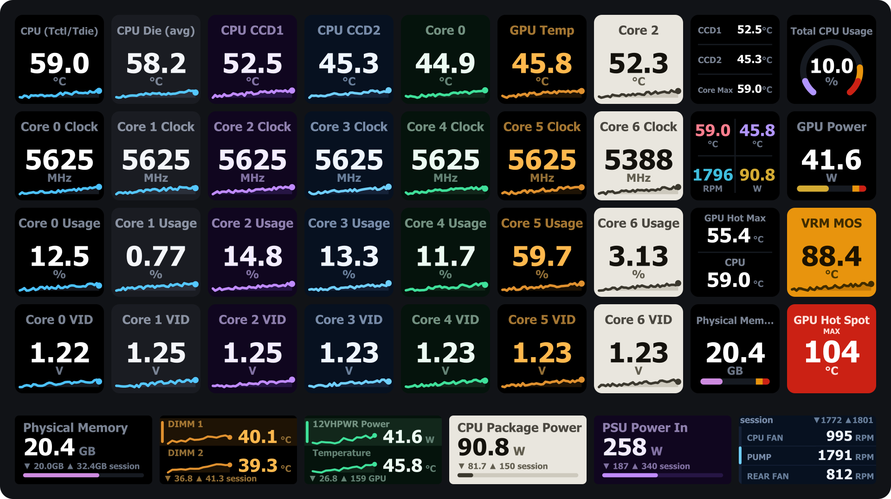
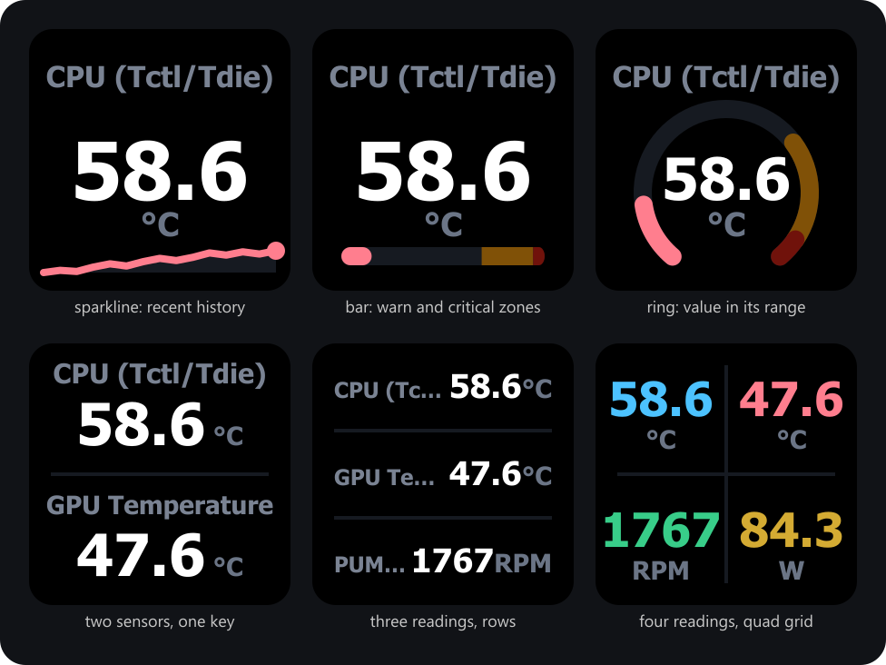
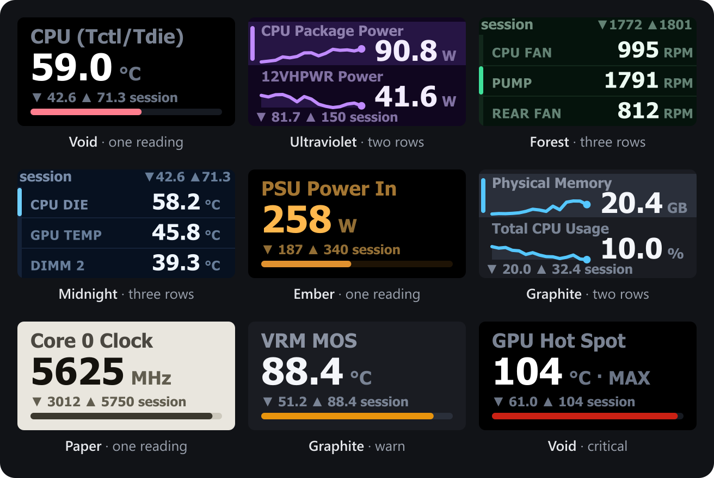
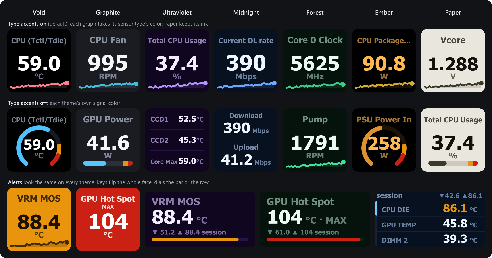
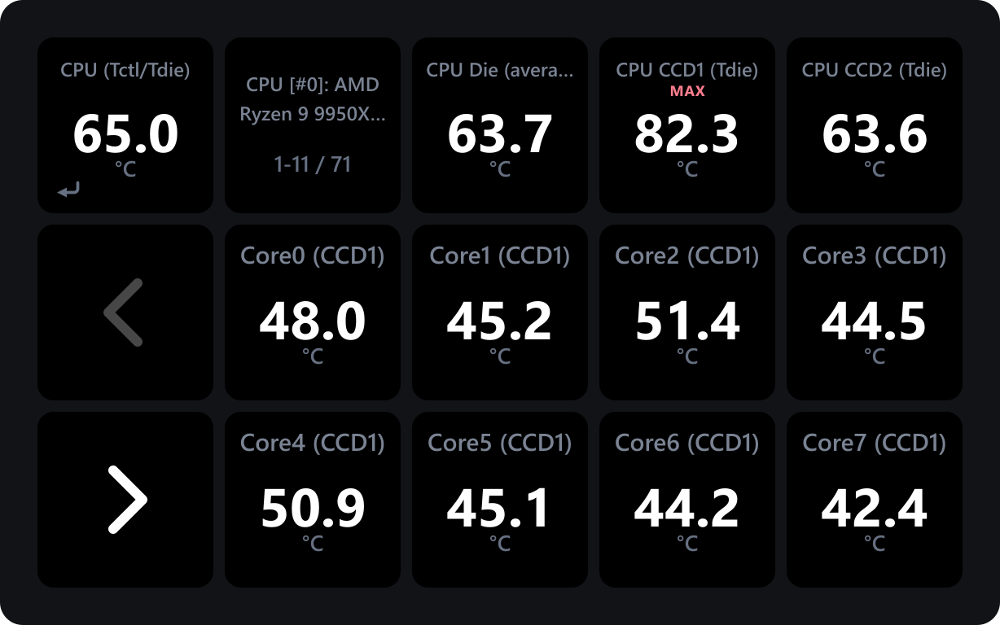
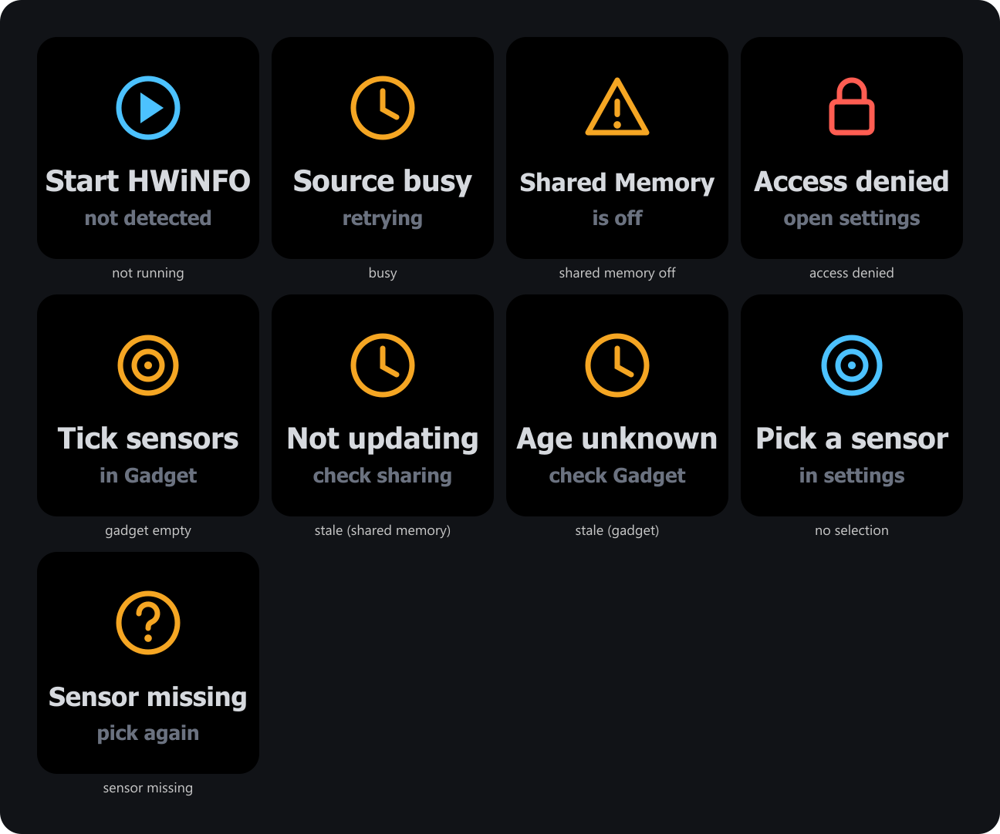

<p align="center">
  
</p>

<p align="center">
  <em>Seven themes (one per column) · one to four readings per key · sparkline, bar and ring · amber <strong>warn</strong> / red <strong>critical</strong> alerts · Stream&nbsp;Deck&nbsp;+ dials in one, two or three rows</em>
</p>

<h1 align="center">HWiNFO Sensors for Stream Deck</h1>

<p align="center">
  <b>Live <a href="https://www.hwinfo.com">HWiNFO</a> readings on your Stream Deck keys and dials.</b><br>
  Temperatures, clocks, fans, usage and power, with a sparkline, bar or ring and amber and red alerts.
</p>

<p align="center">
  <a href="https://marketplace.elgato.com/product/hwinfo-sensors-82436166-3d61-4527-9034-8fdf16d92c54"></a>
  <a href="https://docs.slawrensen.com/hwinfo-streamdeck/"></a>
  <a href="https://github.com/slawrensen/hwinfo-streamdeck/releases/latest"></a>
</p>

<p align="center">
  <a href="#install">Install</a> ·
  <a href="#keys">Keys</a> ·
  <a href="#dials">Dials</a> ·
  <a href="#themes-and-alerts">Themes and alerts</a> ·
  <a href="#sensor-details">Sensor details</a> ·
  <a href="#troubleshooting">Troubleshooting</a> ·
  <a href="#build-from-source">Build</a>
</p>

> [!NOTE]
> **1.7** redesigns the settings panels, adds individual dial colors and
> changes how sources, saved readings and HWiNFO's statistics are handled.
> The upgrade rewrites no stored settings; [what changed in 1.7](https://docs.slawrensen.com/hwinfo-streamdeck/whats-new-1.7.html)
> says where an upgrade needs you to act.

## Install

1. **Install** from the [Elgato Marketplace](https://marketplace.elgato.com/product/hwinfo-sensors-82436166-3d61-4527-9034-8fdf16d92c54), or download the `.streamDeckPlugin` from [Releases](https://github.com/slawrensen/hwinfo-streamdeck/releases/latest).
2. **Turn on sharing** in HWiNFO: *Settings → Shared Memory Support*.
3. **Drag** *HWiNFO Sensors → Sensor Reading* onto a key and pick a reading.

> [!NOTE]
> Needs Windows 10 or later (x64), Stream Deck 6.9+ and HWiNFO. Free HWiNFO
> switches Shared Memory off after 12 hours; if yours runs all day, I recommend
> [HWiNFO Pro](https://www.hwinfo.com/licenses/), which has no limit.

**More:** [Getting started](https://docs.slawrensen.com/hwinfo-streamdeck/getting-started.html) · [Data sources](https://docs.slawrensen.com/hwinfo-streamdeck/data-sources.html)

## Keys

One reading with a sparkline, bar or ring, or up to four readings on one key.



- Press to cycle current, MIN, MAX and AVG: HWiNFO's own statistics over Shared Memory; on the Gadget source they show N/A.
- Labels size themselves to fit; decimals compact through k, M, G and T.
- Temperatures in °C or °F; bytes in decimal or binary units.

**More:** [Sensor Reading](https://docs.slawrensen.com/hwinfo-streamdeck/sensor-reading.html)

## Dials

One reading or several on each Stream Deck + and + XL touchscreen segment, in any of the seven themes.



- **View**: one reading with a range bar, three compact rows, or two rows with big values and a trend line.
- At warn and critical the bar turns amber or red; in the two- and three-row views, which have no bar, the alerting row's number does. The rest of the face keeps its theme.
- **Reading colors**: give each reading on a two- or three-row dial its own number color, or start from the Signal, Pairs or Uniform presets.
- Rotate to move through the readings; the marked row follows and the list scrolls. Touch cycles stats; push resets the session.
- An **HWiNFO Control** key steers a dial from a pedal, a Multi Action or another deck.

**More:** [Sensor Dial](https://docs.slawrensen.com/hwinfo-streamdeck/sensor-dial.html) · [Controls](https://docs.slawrensen.com/hwinfo-streamdeck/controls.html)

## Themes and alerts

Seven themes, set per key or once for the whole deck.



- At the warn threshold the key turns amber; at critical, red. Alert colors are the same on every theme.
- **Alert when the value drops to or below these numbers** flips the comparison for fan RPM or free space.
- **Accent colors** (By sensor type, the default) color the graph by sensor type; choose *Theme accent everywhere* and each theme uses its own color.

**More:** [Themes](https://docs.slawrensen.com/hwinfo-streamdeck/themes.html) · [Thresholds and alerts](https://docs.slawrensen.com/hwinfo-streamdeck/thresholds-alerts.html)

## Sensor details

A key press can open a full page of readings, then return.



- Show every reading from the pressed sensor, a list you build, or a filter such as `*gpu*fan*`.
- Pack up to four readings per tile and page through long sources.
- One editable profile ships per deck type, from Mini to + XL.

**More:** [Sensor details](https://docs.slawrensen.com/hwinfo-streamdeck/sensor-details.html)

## Troubleshooting

When a key can't show a reading, it names the problem and the fix.



<details>
<summary>What each screen means</summary>

| Key shows | Fix |
| --- | --- |
| **Start HWiNFO** | Start HWiNFO with Shared Memory Support or Gadget reporting on. |
| **Source busy** | Momentary; the plugin retries on the next poll. |
| **Shared Memory off** | Turn it back on in HWiNFO Settings; the free version switches it off after 12 hours. |
| **Tick sensors in Gadget** | In HWiNFO: *Configure Sensors → HWiNFO Gadget*, tick *Report value in Gadget* per reading. |
| **Not updating** | Reopen HWiNFO's Sensors window; restart HWiNFO if it repeats. |
| **Age unknown** | Gadget cannot prove HWiNFO is still updating. Check HWiNFO and Gadget reporting. |
| **Access denied** | Open the key's settings and choose **Copy support report** under *Advanced → Support*. See the troubleshooting guide before changing elevation. |
| **Bridge failed** | Reinstall the plugin. If Windows or security software reports a block, keep that report for support. |
| **Source error** | Open the key's settings and choose **Copy support report** under *Advanced → Support*. |
| **Pick a sensor** / **Sensor missing** | Open the key's settings and pick the reading again, or check the current source and any reading link. |

</details>

**More:** [Status screens](https://docs.slawrensen.com/hwinfo-streamdeck/status-screens.html) · [Troubleshooting](https://docs.slawrensen.com/hwinfo-streamdeck/troubleshooting.html) · [FAQ](https://docs.slawrensen.com/hwinfo-streamdeck/faq.html)

## Build from source

```bash
npm ci                  # Node 20+
npm run build:native    # hwsm addon (node-gyp; needs the MSVC C++ build tools)
npm run build           # bundles bin/plugin.js
npm test                # unit suites (node:test)
npm run e2e             # drives the built plugin over a mock Stream Deck
npm run pack            # release/com.lawrensen.hwinfo.streamDeckPlugin
```

Dev loop: `streamdeck dev`, then `streamdeck link com.lawrensen.hwinfo.sdPlugin`
and `npm run watch`. Every command, the project layout and the conventions are
in [AGENTS.md](AGENTS.md). Performance numbers live in [PERF.md](PERF.md).

`bin/hwsm.node`, the native bridge to HWiNFO's shared memory, is unsigned.
Every release from 1.4.0 on publishes its SHA-256 and the pack's; check a copy
with `Get-FileHash <file> -Algorithm SHA256`. See [SECURITY.md](SECURITY.md).

## Credits and license

[MIT](LICENSE). Free, no ads, no telemetry. The original idea came from the
Go plugin by [@shayne](https://github.com/shayne); this is a ground-up
TypeScript rewrite on the official Elgato SDK and shares no code with it.
Full credits in [NOTICE.md](NOTICE.md).

Not affiliated with, endorsed by, or sponsored by REALiX, s.r.o. or Elgato.
"HWiNFO" is a trademark of REALiX, s.r.o.; "Stream Deck" and "Elgato" are
trademarks of Corsair Memory, Inc.
